Lost-and-Found
==============

# 安装

## 1、创建网站目录，克隆文件

## 2、配置数据信息，并从db.sql导入数据

~~~~~~~~~~~~~~~~~~~~~~~~~~~~~~~~~~~~~~~~~~~~~~~~~~~~~~~~~~~~~~~~~~~~~~~~~~~~~~~~
$host = "localhost";
$db_user = "wx_lf_db";
$db_pass = "wx_lf_db";
$db_name = "wx_lf_db";
$timezone = "Asia/Shanghai";
~~~~~~~~~~~~~~~~~~~~~~~~~~~~~~~~~~~~~~~~~~~~~~~~~~~~~~~~~~~~~~~~~~~~~~~~~~~~~~~~

## 3、配置config.php
```

// ****************
//微信公众号配置
// ******************
$appid = "";
$appsecret = "";

// ****************
//邮件服务器配置微
// ******************
$SMTP_Sersers = "smtp.qq.com";
$Email_Account = "*@qq.com";
$Email_Passwd = "*";

$http = "http://lf.wh820.top/";
$RootDir = $_SERVER['DOCUMENT_ROOT'];
$webroot = "/";

$host = "localhost";
$db_user = "wx_lf_db";
$db_pass = "wx_lf_db";
$db_name = "wx_lf_db";
$timezone = "Asia/Shanghai";

$sqllink = mysqli_connect($host, $db_user, $db_pass, $db_name);
mysqli_query($sqllink, "SET names UTF8");

header("Content-Type: text/html; charset=utf-8");
date_default_timezone_set($timezone); //北京时间
```

## 4、完成
## 5、部分界面

<div class="pic_list">
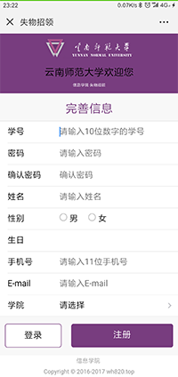
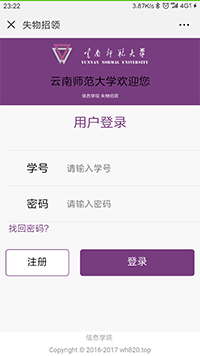
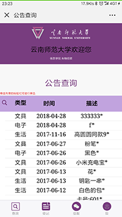

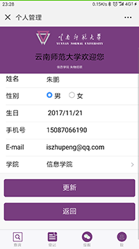
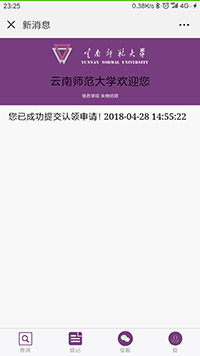

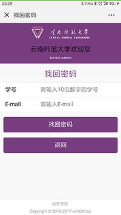
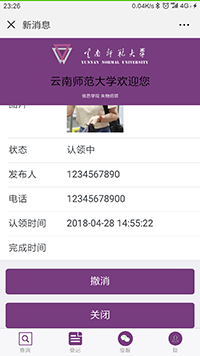
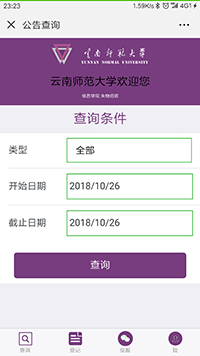
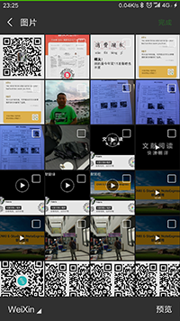
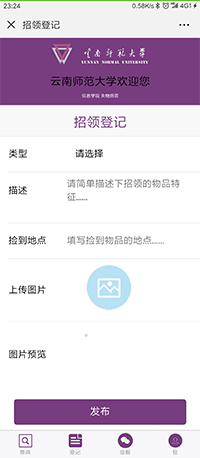
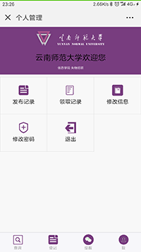
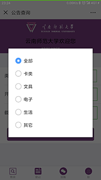

</div>
